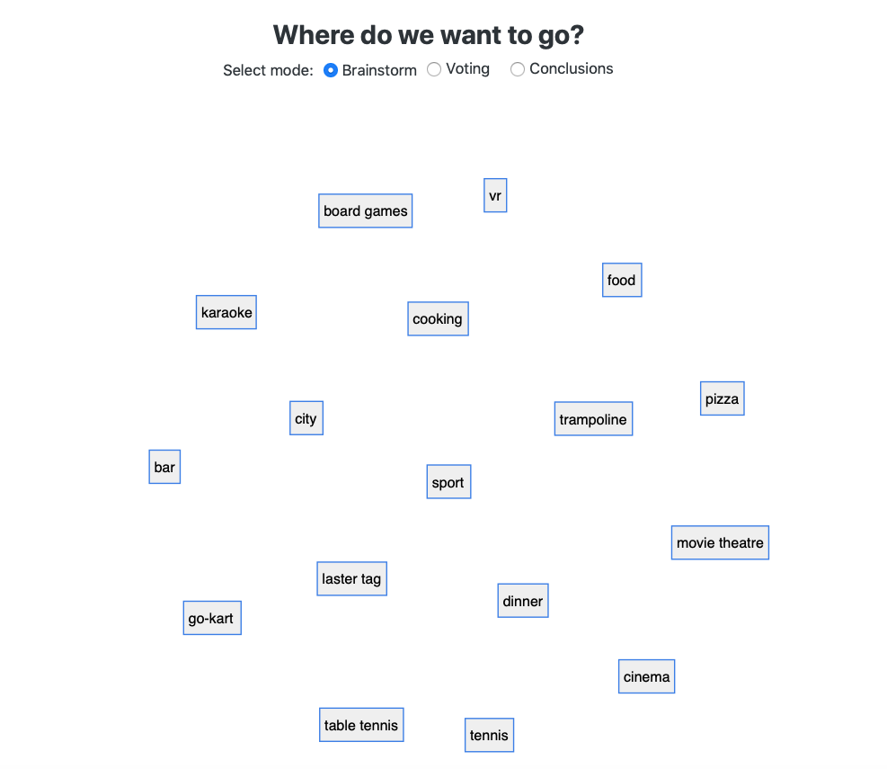
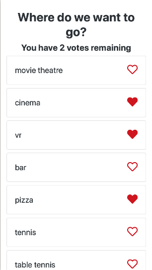
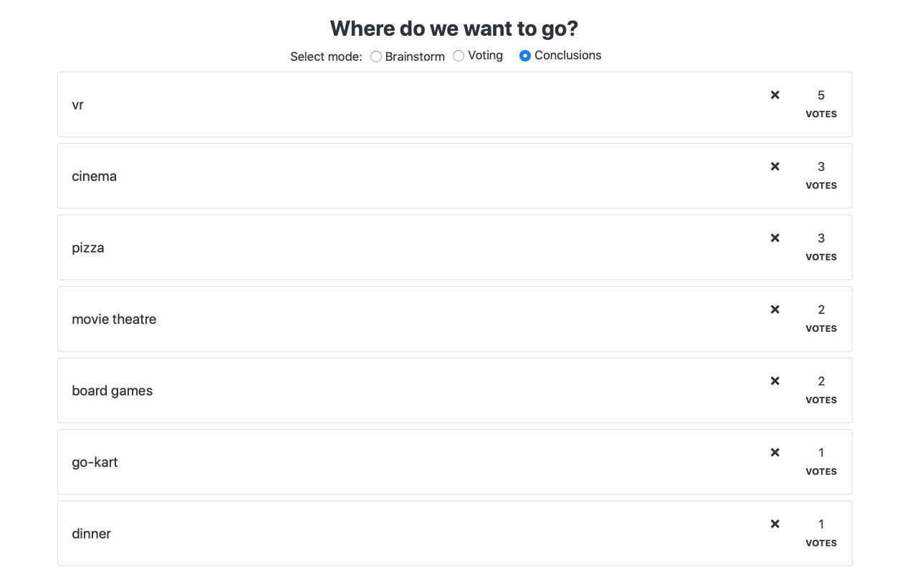

# MindExplode

**Helping remote teams with counducting creative brainstorms leading to better decisions in shorter time.**

Created by Random Dudes team for [BITEhack2020](https://www.bitehack.best.krakow.pl) hackathon on January 11-12, 2020.

## Screenshots

#### Landing page where you can create a brainstorming room

#### Brainstorm participants use their phones to add ideas

#### All added ideas are showing in real time on the master screen

#### Voting phase

#### Results

